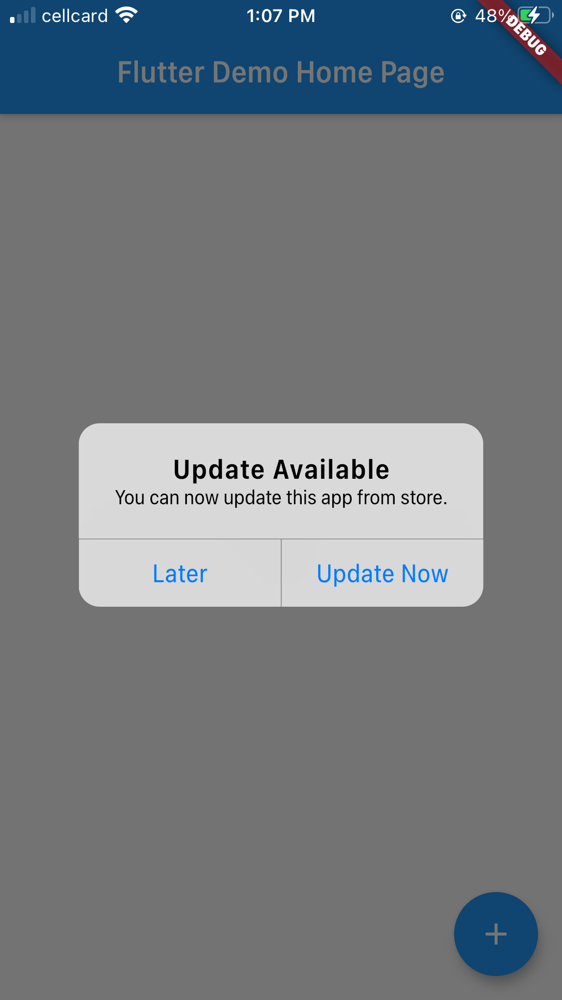

# forceupdate

This package is use for check new version available both ios and android. If it has a new version, you can link to app store or play store. But you need to know app id in store first.

See more at the [Dart Packages page.](https://pub.dartlang.org/packages/new_version)

!

## IOS 

Thanks to Edouard Marquez for adding the iOS functionality.

For iOS 9 and above, your Info.plist file MUST have the following:

```
<key>LSApplicationQueriesSchemes</key>
<array>
        <string>itms-beta</string>
        <string>itms</string>
</array>
```

## Installation
Add force_update as a dependency in your pubspec.yaml file.
```dependencies:
      forceupdate: ^0.0.5
```

## Usage
In `main.dart` (or wherever your app is initialized), create an instance of `CheckVersion` using your current build context.
`final checkVersion = CheckVersion(context: context);`.
Then now you can get app version status by add this line :
```
final appStatus = await checkVersion.getVersionStatus();
if (appStatus.canUpdate) {
      checkVersion.showUpdateDialog(
          "com.companyName.projectName", "id1234567890");
}
    print("canUpdate ${appStatus.canUpdate}");
    print("localVersion ${appStatus.localVersion}");
    print("appStoreLink ${appStatus.appStoreUrl}");
    print("storeVersion ${appStatus.storeVersion}");
```

# force_update
